---

theme: "moon"
transition: "slide"

---

# LAMP Study

## PART 1

Nao Akakura

---

## CARRICULUM

---

## CARRICULUM

1. OS Setup
2. HTTP Server Setup
3. PHP8 Programming
4. Laravel8 + PHP8 Programming

---

## AGENDA

---

## AGENDA

1. VirtualMachineの起動
2. VirtualMachineへのOSインストール

---

## VirtualMachineの起動

---

## VirtualMachineの起動

#### まだHyper-Vを有効化していない人向け

以下を参考に有効にしてください

https://docs.microsoft.com/ja-jp/virtualization/hyper-v-on-windows/quick-start/enable-hyper-v

**※ 場合によってはEFIからIntel VT-Xを有効にしなくてはならないのでご注意ください**

---

## VirtualMachineの起動

#### まだOSを手に入れていない人向け

以下から手に入れてください

https://www.centos.org/download/

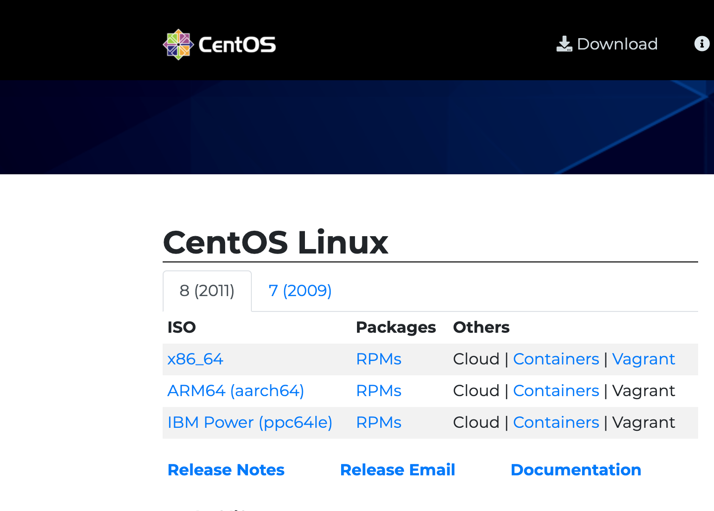

---

## VirtualMachineの起動

#### 仮想スイッチの作成

1. `Hyper-V マネージャ` を開いてください
2. `操作` => `仮想スイッチマネージャ` から仮想スイッチを作成します

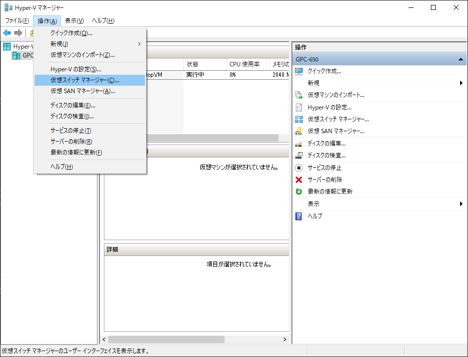

---

## VirtualMachineの起動

#### 仮想スイッチの作成

1. `外部` にデフォルトで選択されているので、そのまま `仮想スイッチの作成` を選択します

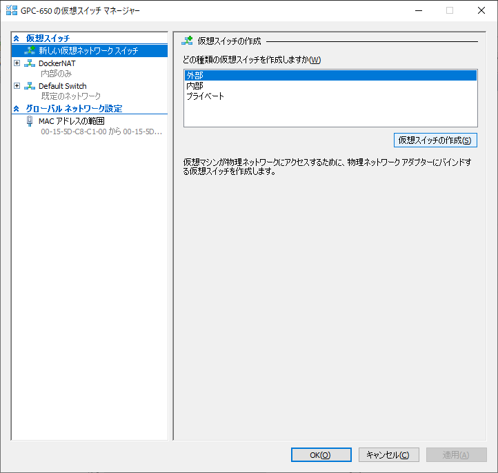

---

## VirtualMachineの起動

#### 仮想スイッチの作成

1. 適当にわかりやすい名前をつけてください
2. `外部ネットワークのコントローラ` は適切に設定してください
3. そこまでできたら、 `適用` を選択してください

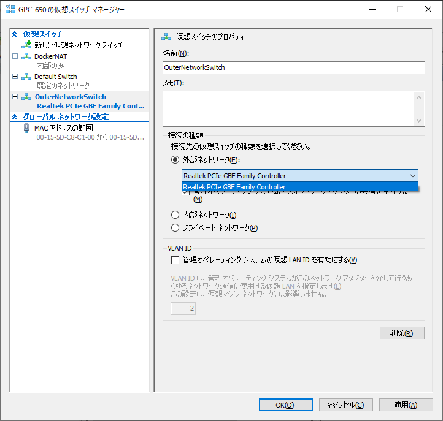

---

## VirtualMachineの起動

#### 仮想マシン(VM)の作成

1. `Hyper-V マネージャ` を開いてください
2. `操作` => `新規` => `仮想マシン` から仮想マシンを作成します

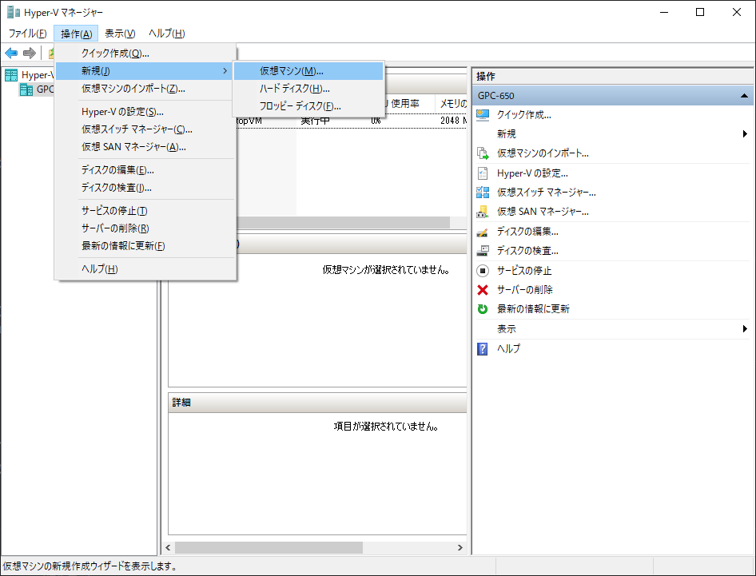

---

## VirtualMachineの起動

#### 仮想マシン(VM)の作成

- `開始する前に`
    - `次へ` を選択してください

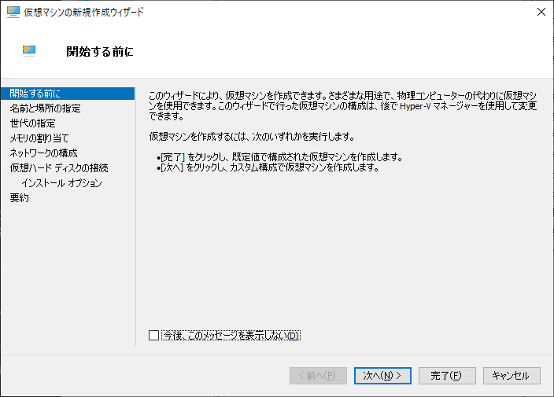

---

## VirtualMachineの起動

#### 仮想マシン(VM)の作成

- `名前と場所の指定`
    - `名前`
        - なんかお好きな名前をつけてください
    - `次へ` を選択してください

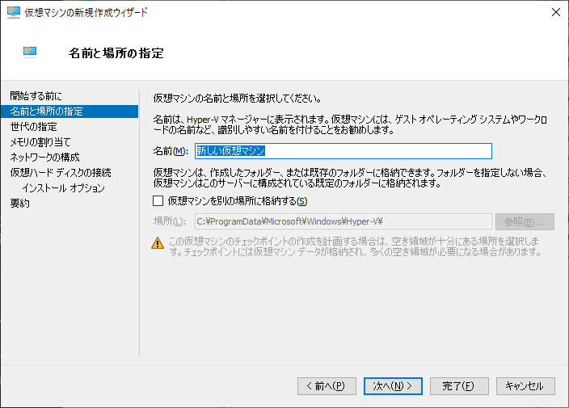

---

## VirtualMachineの起動

#### 仮想マシン(VM)の作成

- `世代の指定`
    - `第1世代` を選択してください
    - `次へ` を選択してください

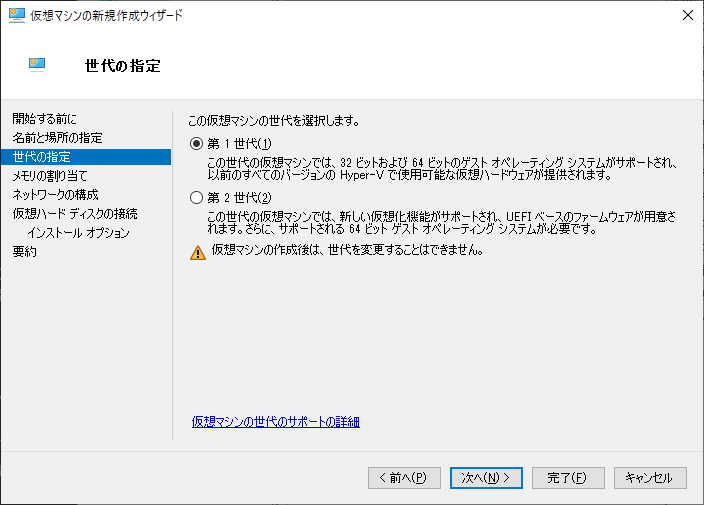

---

## VirtualMachineの起動

#### 仮想マシン(VM)の作成

- `メモリの割り当て`
    - `1024MB` を選択してください
    - `次へ` を選択してください

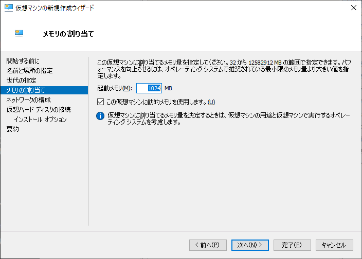

---

## VirtualMachineの起動

#### 仮想マシン(VM)の作成

- `ネットワークの構成`
    - `接続` では先ほど作成したスイッチ名を選択してください
    - `次へ` を選択してください

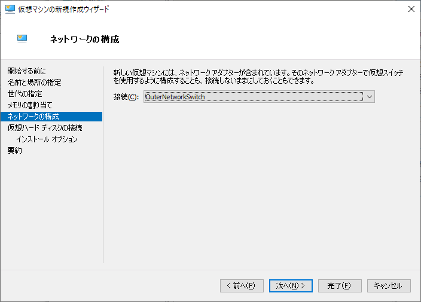

---

## VirtualMachineの起動

#### 仮想マシン(VM)の作成

- `仮想ハードディスクの接続`
    - `名前` では必要があれば好きな名前をつけてください
    - `次へ` を選択してください

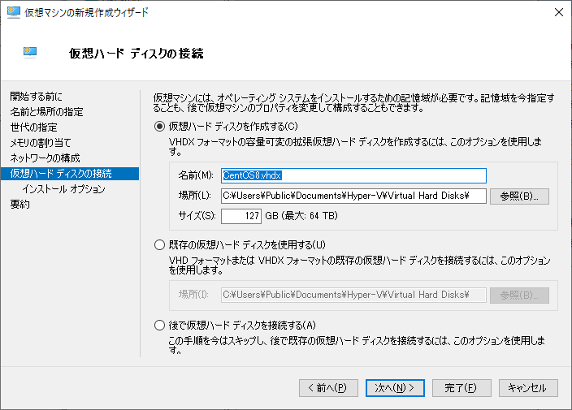

---

## VirtualMachineの起動

#### 仮想マシン(VM)の作成

- `インストールオプション`
    - `ブート CD/DVD-ROM からオペレーティング システムをインストールする` をEnableにし、DLしておいたCentOS8のISOファイルを指定してください
    - `次へ` を選択してください

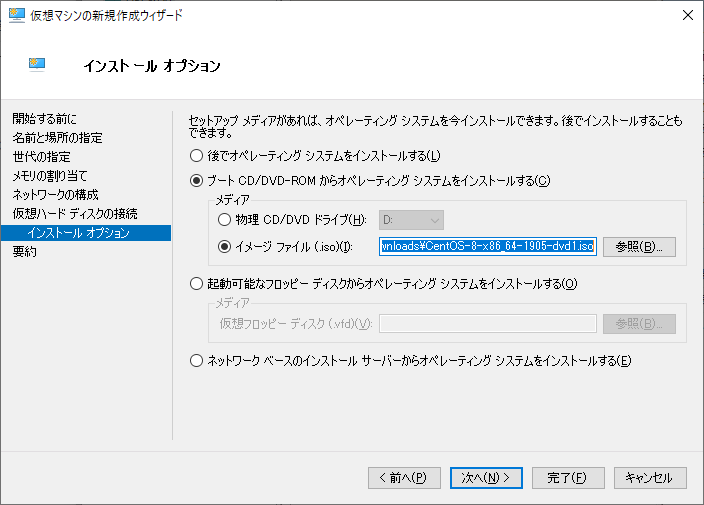

---

## VirtualMachineの起動

#### 仮想マシン(VM)の作成

- `仮想マシンの新規作成ウィザードの完了`
    - `完了` を選択してください

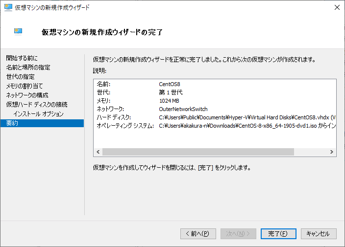

---

## VirtualMachineの起動

#### 仮想マシン(VM)の作成

1. `Hyper-V マネージャ` を開いてください
2. 先ほど作成したVMを選択して、起動してください

---

## VirtualMachineへのOSインストール

#### OSをインストール

1. `Install CentOS Linux 8.0.xxxx` を選択してEnterを押してください

---

## VirtualMachineへのOSインストール

#### OSをインストール

1. ここからGUI操作になります
2. `インストールする言語` を選択してください
    1. `日本語` を選択するでよいです

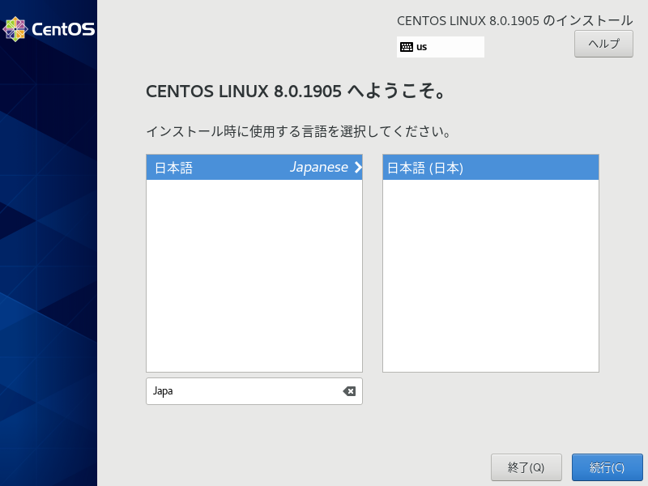

---

## VirtualMachineへのOSインストール

#### OSをインストール

1. 右上の `インストール先` を選択してください

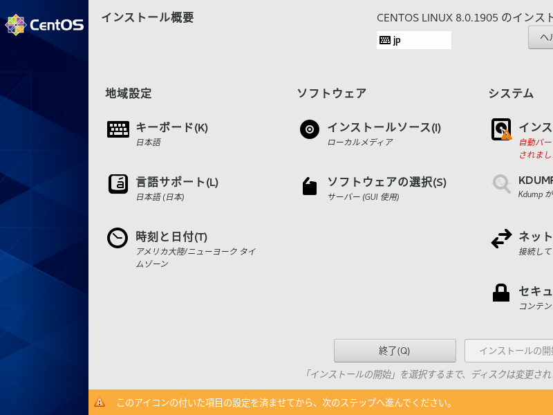

---

## VirtualMachineへのOSインストール

#### OSをインストール

1. `ローカルの標準ディスク` に表示されているディスクを選択してください
2. `完了` を選択してください

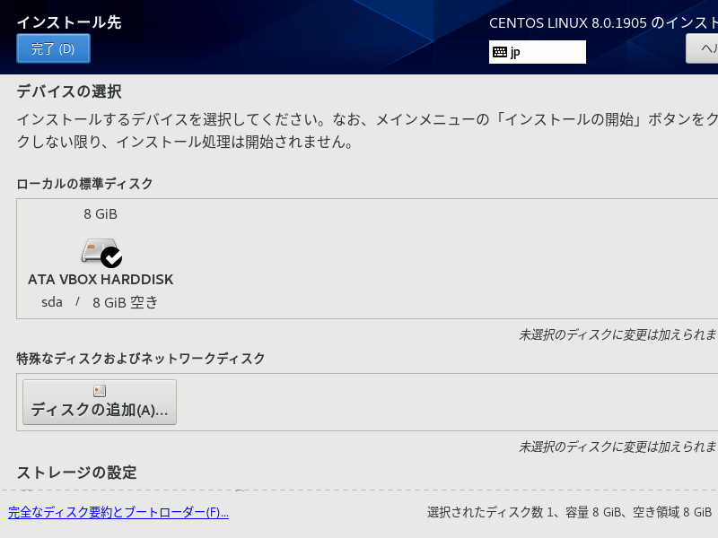

---

## VirtualMachineへのOSインストール

#### OSをインストール

1. `ソフトウェアの選択` を選択してください

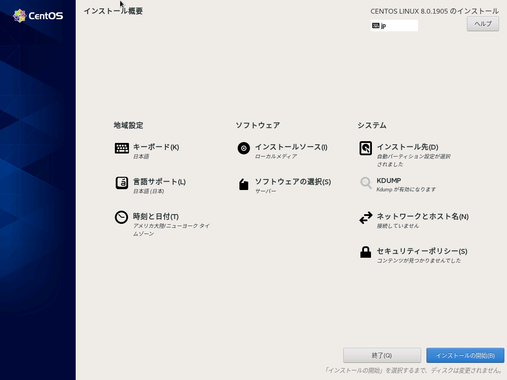

---

## VirtualMachineへのOSインストール

#### OSをインストール

1. `サーバー` を選択してください
2. `完了` を選択してください

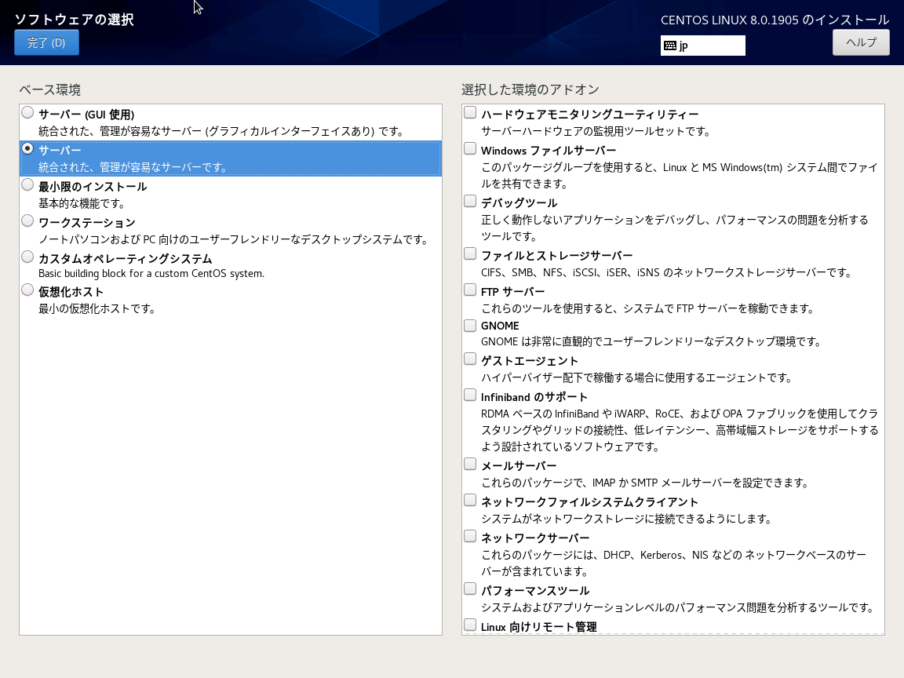

---

## VirtualMachineへのOSインストール

#### OSをインストール

1. `インストールの開始` を選択してください

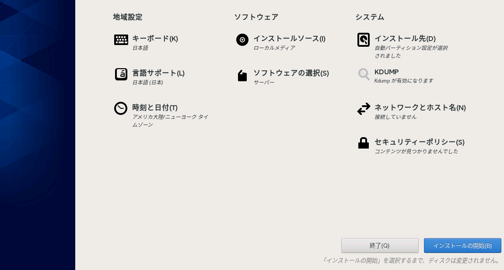

---

## VirtualMachineへのOSインストール

#### OSをインストール

1. `root` パスワードの設定をおこないます
2. ユーザを作成します

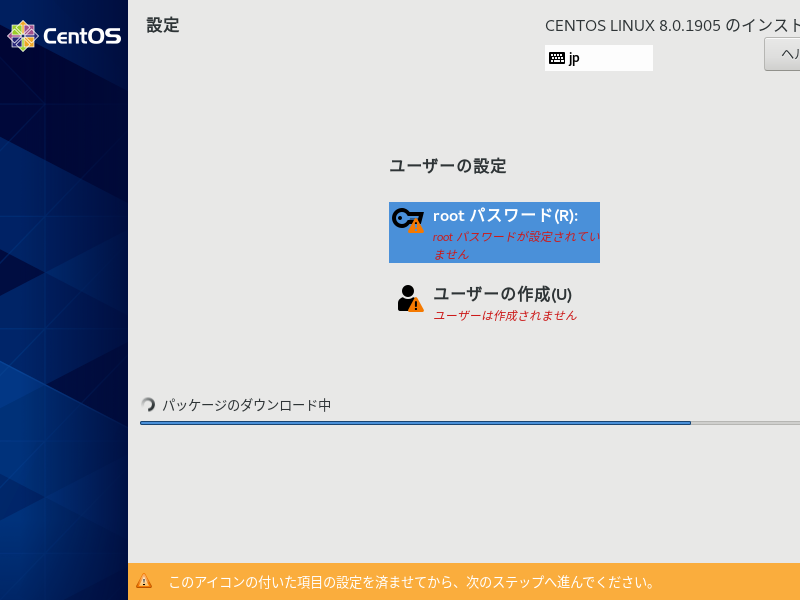

---

## VirtualMachineへのOSインストール

#### OSをインストール

1. `root` パスワードを入力してください
2. `完了`を選択してください

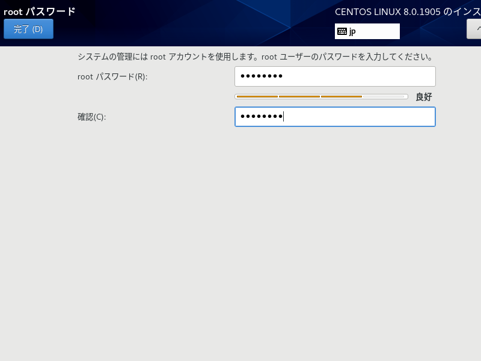

---

## VirtualMachineへのOSインストール

#### OSをインストール

1. 使用するユーザ情報を入力してください
2. パスワードを二度入力してください
3. `このユーザを管理者にする` はEnableにしてください
4. `完了`を選択してください

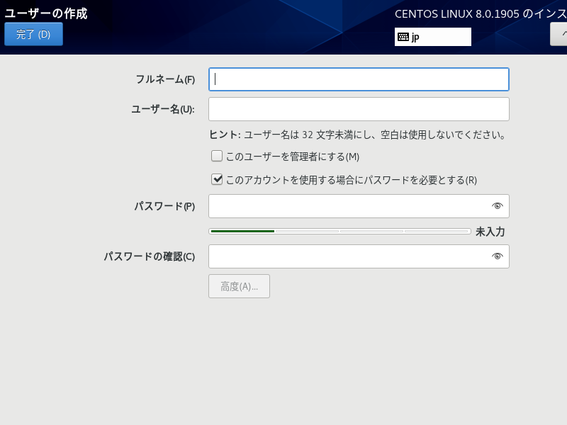

---

## VirtualMachineへのOSインストール

#### OSをインストール

1. そのままインストールが完了するまで待機してください
2. 待機していると、そのうち「再起動」ボタンが表示されますので、それを選択してください

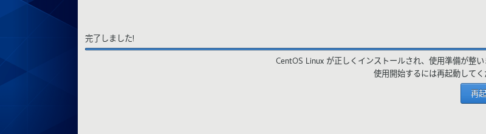

---

## VirtualMachineへのOSインストール

#### OSをインストール

- 起動しているVMのウィンドウの `メディア` => `DVDドライブ` => `取り出し` を選択します
    - この操作で、最初にセットしたインストールディスクの取り出しをおこないます
- その状態で、再度VMを再起動します

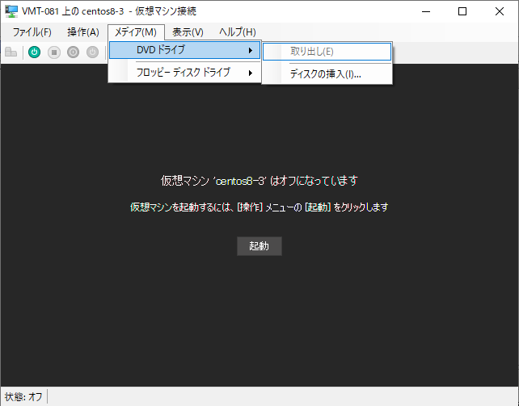

---

## VirtualMachineへのOSインストール

#### OSをインストール

- とりあえず一番上の `CentOS Linux` となっているものを選択してEnterで選択します

---

## VirtualMachineへのOSインストール

#### OSをインストール

- 画像のようなログイン画面が出ればOKです

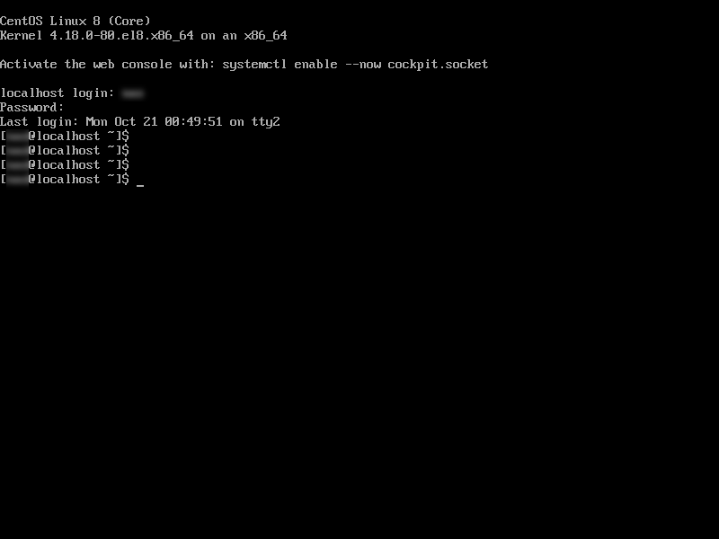

---

## VirtualMachineへのOSインストール

#### ネットワーク設定

1. ログインします
2. ターミナルで `ip addr` コマンドを入力します
3. `LO` となっていないアダプタの名前を控えます

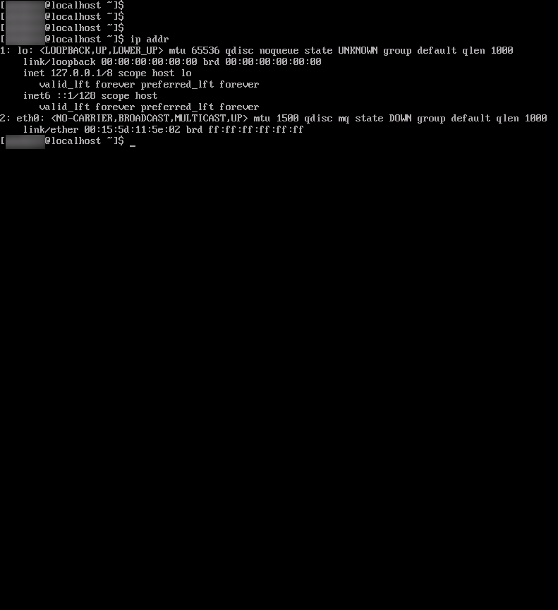

---

## VirtualMachineへのOSインストール

#### ネットワーク設定

1. `nmtui` コマンドを入力します
2. ブルーバックの画面が出ましたら、 `Edit a connection` を選択してEnterを入力します

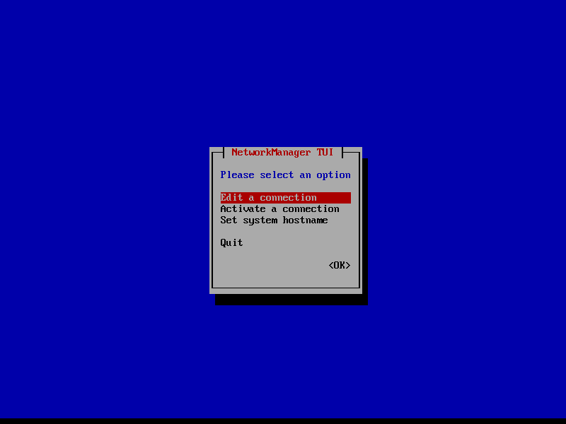

---

## VirtualMachineへのOSインストール

#### ネットワーク設定

1. `Ethernet` の一覧から、先ほど控えた名前と同じものを選択してEnterを入力します

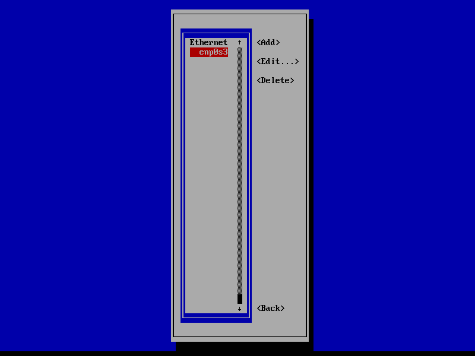

---

## VirtualMachineへのOSインストール

#### ネットワーク設定

1. 以下の操作を実施します
    - `IPv4 Configuration` を `Automatic` に
    - `IPv6 Configuration` を `Ignore` に
    - `Automatically connect` を Enable に
2. OKを選択してEnterを入力します

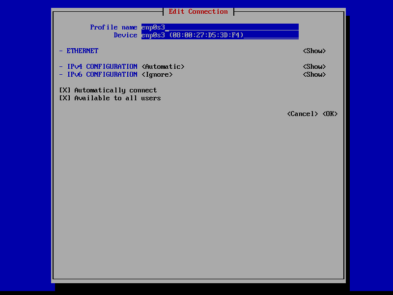

---

## VirtualMachineへのOSインストール

#### ネットワーク設定

1. `<Back>` を選択してEnterを入力します

---

## VirtualMachineへのOSインストール

#### ネットワーク設定

1. Quit を選択して、OKを選択してEnterを入力します

---

## VirtualMachineへのOSインストール

#### ネットワーク設定

1. `ping 8.8.8.8` コマンドを入力します
    - レスポンスがあれば設定完了です

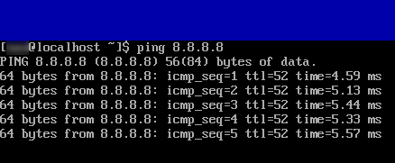

---

# LAMP Study

To Be Continued...